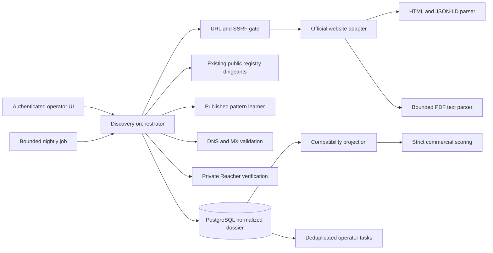
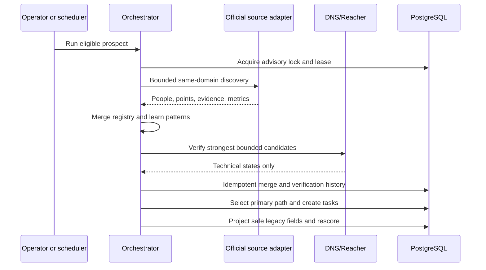

# Contact intelligence architecture

## Components

## Data flow

## Trust boundaries

1. Browser to application: authenticated; HTML state changes pass CSRF middleware and server validation.
2. Application to public web: hostile input boundary; no JavaScript execution, private addresses blocked, redirects revalidated, bodies and MIME types bounded.
3. Application to Reacher: private Compose network only; minimal address input, normalized summary output, no raw payload persistence.
4. Application to PostgreSQL: normalized dossier is authoritative; manual facts outrank automation.
5. Human research: LinkedIn is manual only. The system creates search paths and records operator confirmation; it does not log in, scrape, connect, or message.

## Failure behavior

- One adapter failure is recorded on the run and does not erase existing facts.
- Reacher failure leaves website contacts available and guessed mailboxes unpromoted.
- Ambiguous company/domain match stops site fact application.
- Active lease rejects a duplicate run.
- Per-prospect nightly errors roll back that prospect and continue the batch.
- Suppression prevents discovery and cancels contact-intelligence tasks.
